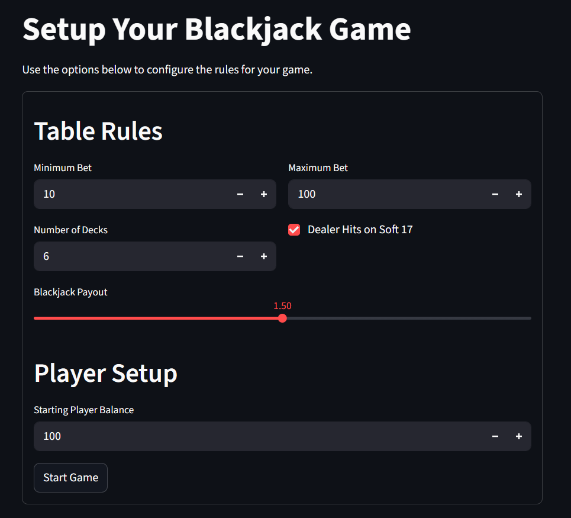
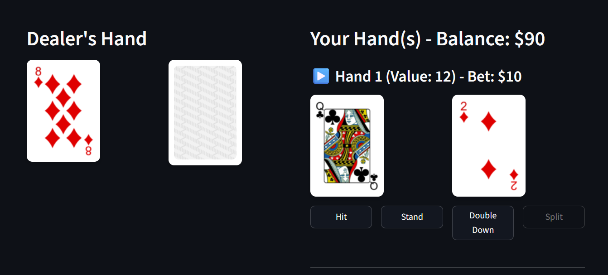

# Blackjack Game with Clean Architecture

This project is a web-based Blackjack game built with Python and Streamlit. It serves as a practical example of implementing a Clean Architecture design in Python, resulting in a codebase that is modular, testable, and easy to extend.

## A Note on the Development Process

This project was conceived and built in approximately two days as an experiment in AI-assisted development. The primary goal was to explore a "vibe coding" approach, leveraging Google's `Gemini CLI` to understand the workflow and productivity gains of using generative AI tools for programming.

## Features

- **Full Blackjack Gameplay:** Implements all standard player actions including Hit, Stand, Double Down, and Split.
- **Realistic Deck Management:** Simulates a casino-style multi-deck shoe with a discard pile and deck penetration rules for reshuffling.
- **Configurable Game Rules:** Use the UI to configure betting limits, number of decks, and dealer behavior (e.g., stands or hits on soft 17).
- **Interactive Web Interface:** A user-friendly, web-based UI built with Streamlit.

## Architecture

This project strictly follows the principles of **Clean Architecture**. The code is organized into four distinct layers, ensuring a complete separation of concerns between the core business logic and external frameworks like the UI.

1.  **Domain:** Contains the core game entities and business rules (e.g., `Card`, `Hand`, `Player`). It has no dependencies on any other layer.
2.  **Application:** Contains the application-specific use cases that orchestrate the domain entities (e.g., `PlayerAction`, `DetermineOutcome`).
3.  **Interface Adapters:** Connects the core application to the outside world. This includes the `GameController` and `GamePresenter`.
4.  **Infrastructure:** The outermost layer, containing the specific implementations of external concerns, such as the Streamlit UI and the command-line interface.

## Screenshots





## Getting Started

Follow these instructions to get a local copy up and running.

### Prerequisites

- Python 3.9+ and `pip`

### Installation

1.  **Clone the repository:**
    ```sh
    git clone <your-repository-url>
    ```
2.  **Navigate to the project directory:**
    ```sh
    cd <project-directory>
    ```
3.  **Install the required dependencies:**
    ```sh
    pip install -r requirements.txt
    ```

### Running the Application

To run the web-based game, execute the following command from the project's root directory:

```sh
streamlit run main_streamlit.py
```

This will start the Streamlit server and open the application in your web browser.

## Running Tests

The project uses `pytest` for unit testing. The tests are located in the `tests/` directory and mirror the structure of the `src/` directory.

To run the tests, execute the following command from the root directory:

```sh
pytest
```

## Project Structure

```
├── assets/             # Card images
├── src/
│   ├── application/    # Use cases
│   ├── domain/         # Core business logic and entities
│   ├── infrastructure/ # UI implementations (Streamlit, CLI)
│   └── interface_adapters/ # Controller, Presenter, View Models
├── tests/              # Unit tests
├── main_streamlit.py   # Entry point for the Streamlit app
├── main.py             # Entry point for the original CLI app
└── requirements.txt    # Project dependencies
```
